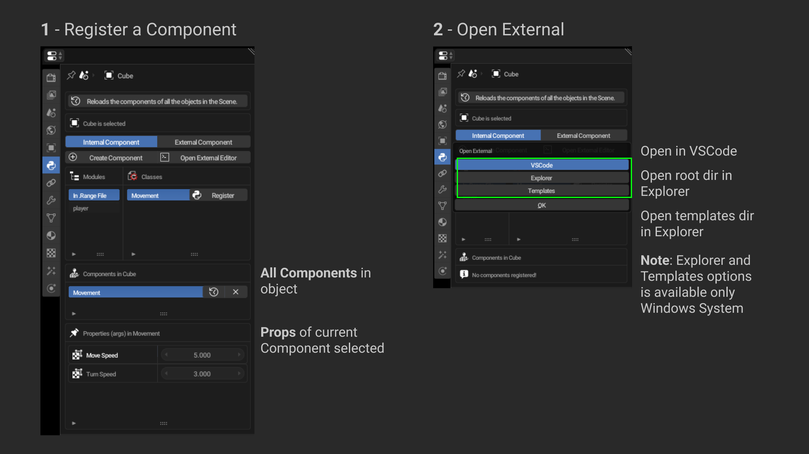
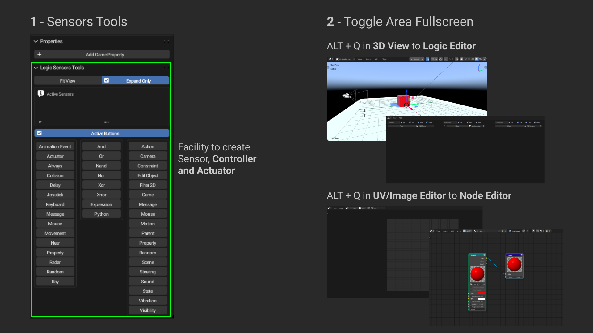

# Range Component Label

Lang: [Português (PT-BR)](./README_PT.md) - [English (EN)](./README.md)

- [Usage](#how-to-use)
- [Preferences](#addon-preferences)
- [Stages](#stages-of-range-component-label)
- [Create](#create-component)
- [Link and Copy](#link-and-copy-component)
- [Edit](#editing-component)
- [Register](#register-and-open-external)
- [Sensor Tools](#sensor-tools-and-toggle-area)

#### Donwload: [release 1.4](https://github.com/misael-s/Range_Component_Label/releases/tag/v1.4.0)

## **What is it**

Range Component Label is a facilitator to work with the creation, editing and registration of .Range Components (Scripts). It allows using and organizing Components internally (.Range) and/or externally (root directory where .Range is saved), making the entire development process faster and simpler.

## How to use

Using the Range Component Label is pretty easy once you understand its purpose. The way to work with it serves both those who program their codes internally through the Text Editor, and those who want to use another text editor.

### Addon Preferences

You can define some additional functionality in the Range Component Label. Test each option and see which one to enable for the best use when working with Components.

When creating the templates directory, do not leave scripts in the root, create one or more folders in the root where you will store the scripts. At least one script is required in the templates directory to be visible in the addon's INTERNAL tab. You can use the engine's default Component or [this](https://rangeengine.tech/api/14/html/api/bge.types.KX_PythonComponent.html#KX_PythonComponent) to create the file in the template directory following the structure below:

**Do this**:
> - templates_dir
>   - scripts
>     - player
>       - move.py
>     - enemy
>   - othe_scripts
>     - ui.py

**Don't do this**:
> - templates_dir
>   - move.py

_**This also applies to the organization of components in the root directory where your project's .range is located.**_

### Stages of Range Component Label

When you set preferences for the Range Component Label its behavior changes. Also when you create a new project it presents a different interface.

### Create Component

You can create a Component in three places:
- In .Range File - internal to the project's .range
- Template directory
- Project root directory

### Link and Copy Component

With the models directory defined you will be able to link a Component from that directory to the .range or copy it to the root directory of the project.

### Editing Component

To edit a component with Range Component Label is simple, just double click on the class.

### Register and Open External

Once you have Components created you can register them in objects. Also, you will be able to open the templates directory and the current project directory.

### Sensor Tools and Toggle Area

You can activate the Sensor Tools option to enable new functionality in the Logic Editor.

Also, by default, Toggle Area is enabled. It allows you to quickly change areas to better work on creating your game.

[[GoTo Top]](#range-component-label)
