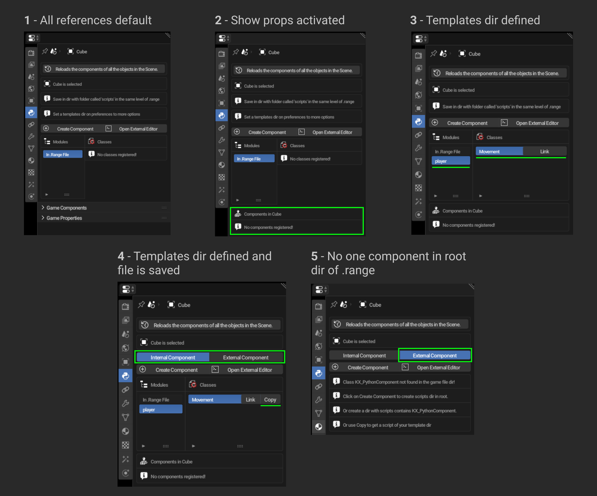
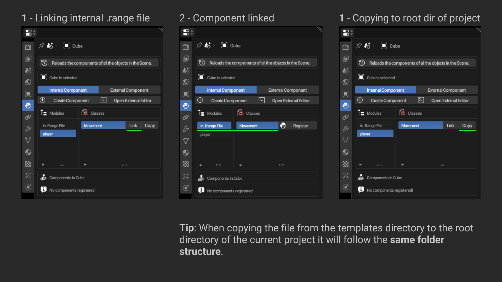
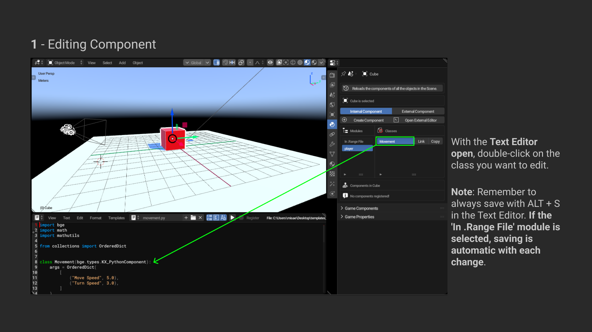

# Range Component Label

Lang: [Português (PT-BR)](./README_PT.md) - [English (EN)](./README.md)

- [Usage](#uso)
- [Preferences](#addon-preferences)
- [Stages](#stages-of-range-component-label)
- [Create](#create-component)
- [Link and Copy](#link-and-copy-component)
- [Edit](#editing-component)
- [Register](#register-and-open-external)
- [Sensor Tools](#sensor-tools-and-toggle-area)

## **O que é?**

Range Component Label é um facilitador para se trabalhar com a criação, edição e registro de Components (Scripts) da .Range. Ele permite utilizar e ornanizar os Components de maneira interna (.Range) e/ou externa (diretório raiz onde fica salvo .Range), tornando todo o processo de desenvolvimento mais rápido e simplificado.

## Uso

O uso do Range Component Label é bem fácil uma vez que se entende seu propósito. A maneira de trabalhar com ele atende tanto aqueles que programam seus códigos internamente através do Text Editor, quanto aqueles que queiram utilizar outro editor de texto.

### Addon Preferences

Você pode definir algumas funcionalidades adicionais no Range Component Label. Teste cada opção e veja qual habilitar para melhor proveito ao trabalhar com Components.

Quando criar o diretório de modelos não deixe scripts na raiz, crie uma ou mais pasta na raiz onde vai guardar os scripts.

**Do this**:
> - templates_dir
>   - scripts
>     - player
>       - move.py
>     - enemy
>   - othe_scripts
>     - ui.py

**Don't do this**:
> - templates_dir
>   - move.py

_**Isso também vale para a organização dos components no diretório raiz onde fica o .range do seu projeto.**_

### Stages of Range Component Label

Quando você define as preferências do Range Component Label seu comportamento é alterado. Também quando você cria um novo projeto ele apresenta uma interface diferente.

### Create Component

Você pode criar um Component em três lugares: 
- In .Range File - interno ao .range do projeto
- Diretório de modelos
- Diretório raiz do projeto

### Link and Copy Component

Com o diretório de modelos definido você conseguirá linkar um Component desse diretório ao .range ou copiar para o diretório raiz do projeto.

### Editing Component

Para editar um component com Range Component Label é simples, basta clicar duas vezes na classe.

### Register and Open External

Uma vez que você tenha Components criados você poderá registrá-lo em objetos. Também, você conseguirá abrir o diretório de modelos e o diretório do projeto atual.

### Sensor Tools and Toggle Area

Você pode ativar a opção de Sensor Tools para habilitar novas funcionalidades no Logic Editor.

Também, por padrão, o Toogle Area está habilitado. Ele permite que você troque de area de forma rápida para melhor trabalhar na criação do seu jogo.

[[GoTo Top]](#range-component-label)